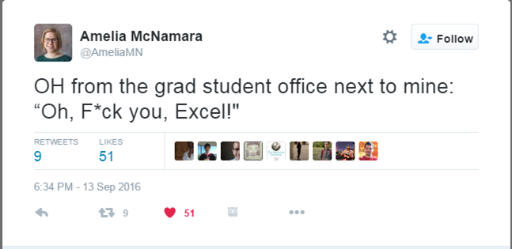

```{r setup, include=FALSE}
knitr::opts_chunk$set(echo = TRUE)
```

## Outline
* Matrices
* Data frames
* Indexing & Subsetting
* Exercise

## Recap
* Vectors Defined
* Atomic Vectors
* Lists

## Intro
* Before we start make sure of your **working directory** and clear your **Workspace**
* So far we've been looking at one-dimensional data structures
* Recall that vectors always of have one data type e.g. strings, while lists can contain different types.
* Matrices and data frames, **respectively**, are the 2-dimensional analogues of the above data structures.


# Matrices
***

* Unlike vectors, they are 2-dimensional, having rows & columns.
* Like vectors, they are only of particular type i.e. integer, character, numeric, logical, etc.
* Can be built from scratch using `matrix()`
* Others include `rbind()`, `cbind()`.
* **Matrix arithmetic** possible in R but beyond the scope of this discussion.

***

```{r matrix function}
args(matrix)  # or ?matrix
```

***

The parameters:

* `data` - usually a vector (Default is `NA`)
* `nrow` - number of rows (Default is $1$)
* `ncol` - number of columns (Default is $1$)
* `byrow` - Do you want to arrange them by rows? (Default is `FALSE`)
* `dimnames` - A `list` with rownames and/or columnnames.

***

To make a matrix with numbers $1 - 12$ that has 3 rows and 4 columns
```{r make matrix}
mat <- matrix(1:12, nrow = 3, ncol = 4) # other arguments supplied as defaults
```

***

To transpose the dimensions of the matrix
```{r reverse dims}
(mat <- matrix(1:12, nrow = 4))  # can calculate other dimensions
```

To transpose the order of values in the matrix
```{r reverse order}
mat <- matrix(1:12, nrow = 4, byrow = TRUE)
mat
```

***

To label the dimensions
```{r add dimnames}
mat <- matrix(1:12,
              nrow = 4,
              byrow = T,
              dimnames = list(c('north', 'south', 'east', 'west'),
                              c('land', 'water', 'air')))
mat
```

***

The function `matrix()` requires care with using the right dimensions
```{r dimension error}
matrix(1:13, nrow = 4)
```

***

We can make a matrix from exising vectors or matrices.

```{r matrix from vectors}
upper <- LETTERS
lower <- letters
ABCabc <- matrix(c(upper, lower), ncol = 2)
ABCabc
```

***

Or like this
```{r}
(ABCabc <- cbind(upper, lower))
```

***

```{r}
(ABCabc <- rbind(upper, lower))
```

***

* Matrix creation is also useful in other operations such as drawing multiple plots.
* Exploring can be a matrix with the following functions.
    + `View()`
    + `dim()`
    + `str()`
    + `summary()`
    + `typeof()`
    + `class()`
    + `colnames()`
    + `rownames()`
    + `is.matrix()`
    + `edit()`
* Quickly try them out. What do you notice?

# Data frames
## Introuction
* In data management, this is the most commonly used R object
* You will either:
    + Get a data frame
    + Make your own data frame
* Also have columns and rows. Usually represent
    + Columns -- variables
    + Rows -- observations
* Like a list, can have different types.
* **Each column is actually a vector!**

## Making a data frame
* Can be built from scratch using the function `data.frame()`.
    + Combines vectors with same length.
* Vectors with different lengths are built using `expand.grid()`

***
```{r make df}
dframe <- data.frame(position = 1:26, upper, lower)
dim(dframe)
```

```{r expand grid}
exp.df <- expand.grid(position = 1:13, upper, lower)
dim(exp.df)
```

## Importing data frames
* Many datasets are imported as data frames
* A useful file format is .csv
* Key function is read.table() & its variants
* Easiest way to start is save Excel files as CSV
* Many useful packages other data formats e.g. EXcel, SPSS.

**Practical Demo**: Convert Excel to CSV

***



***
```{r read.csv}
tbl <- read.csv('../data/whostat2005_healthsystems_prepped.csv')
dim(tbl)
```

# Indexing & Subsetting

## Motivation
```{r small data}
smallVec <- round(runif(n = 10, min = 1, max = 10))
smallVec
```

* Which is the first value?
* Which is the last value?
* Which is the smallest value?
* Which is the largest value?
* Which is values occur more than 1X?
* Many other questions...

***

```{r large data}
largeVec <- sample(rep(month.abb, 100), 200, replace = TRUE)
largeVec
```

## The `[]` Operator
Note the bracket in the previous output

* Enables you to get or set elements of a data structure
    + For vectors: [ ]
    + For matrices & data frames: [ , ]
    + For lists: [ ] and [[ ]]

*** 

### For Vectors
```{r}
letters[1]; letters[26]
fiveLet <- letters[1:5]
fiveLet
fiveLet[3] <- 'center'
fiveLet
```

*** 

```{r, error=TRUE}

letters[c(4, 9, 7)]
letters[4, 6:3]
```

**Quiz**: Fix the error in the last expression.

***

### For Matrices and Data frames
* The format for indexing these is [row, column]
    + [1, 2] means "first row, second column"
* This notation is for mapping the location of an element in a 2-dimensional data structure.

***

If you want to get a value of matrix `matObj` on the 4th row and the 3rd column, you run `matObj[4, 3]`

```{r}
mat
mat[4, 3]
```

***

If you want to change a value of `matObj` on the 4th row and the 3rd column, you run `matObj[4, 3] <- <new value>`

```{r}
mat[4, 3] <- 1000
mat
```

***

As demonstrated with vectors, ranges also work very well with 2-dimensional indexing.

**Note**: An empty value means 'ALL' e.g. [, 3] meants "all the rows in column  5. This looks like this
```{r}
mat[, 3]
```
And conversely,
```{r}
mat[3, ]
```

***

### For Lists
* In addition to `[]` we have `[[]]`
    + The former will produce a list element
    + The latter will produce the component object
```{r}
someList <- list(upper, lower, pi, month.name)
someList
```

***

```{r}
someList[3]
someList[[3]]
```

## The `$` Operator
This operator works only for objects of type `list`.
* Did I tell you that a data frame is also a list?

```{r}
typeof(dframe)
str(dframe)
``` 

***

```{r}
str(someList)
```

* Note the `$` in the output.
* This operator occurs in every list, but can only be used for subsetting/indexing when the object is named.

***

* To subset the column of a data frame, the easiest (and safest) way is to use this operator
```{r}
dframe$position
dframe$upper
```

This subsetted element is always a vector!


# Conclusion
***

* We have run through the main R data structures
* We have also seen some simple ways of manipulating them.
* The key to learning R is continous practice.
* Practical use cases abound.
* Scripting can be hard work, but you will do the hard work only once!
* From here we will look at the practical use cases
    + General uses
    + Specific NARC Data management project
    + Prospects