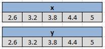
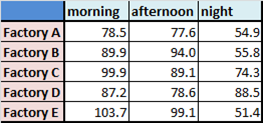
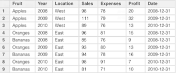

```{r setup, include=FALSE}
knitr::opts_chunk$set(echo = TRUE)
```

# Understanding the R Session

## Variables - Names vs. Data
There are 2 very fundamental concepts in R that are good to grasp:

* Names
* Data

In R, when we create an object, what we have is a piece of **data** in memory that is pointing to a **name** in the workspace (aka environment).

```{r}
x <- 'red'
x
```
## Naming Rules and Conventions
A name cannot:

* start with an underscore (`_`), but allowed elsewhere in the name
* start with a number, but allowed elsewhere
* contain special characters other than alphanumerics. 
These rules can be overridden by surrounding the name in backticks (**`**).

Other than this, there are no limits to possible names for our R objects.

* can use `lowercase`, `UPPERCASE`, `camelCase`, `snake_case`, etc.

***

* It is the name that gives the data some meaning.
* When coding it is often best to use a name with some kind of context.
* This makes the code to be more readable.

```{r good naming}
x                # okay
colour <- x      # better
colour
likeBlood <- x   # probably much better
``` 

***


# Data Structures
## Atomic Vectors
* 1 or more elements
* 1 dimension; exists as a chain of data elements
* `c()` is most often used to create them
* elements must be of the same type, otherwise coercion/error
* indexed using the `[]` operator
* named vectors - can be used for indexing

***
```{r}
colour <- c(likeBlood, c('purple', 'green'))
names(colour) <- c('apple', 'grape', 'pear')
colour

colour[2]

colour['grape']
```
***



## Lists
* 1 or more elements
* 1 dimension; exists as a chain of data elements
* `list()` is most often used to create them
* elements can be of any type or object, including lists
* indexed using both the `[]` and `[[]]` operators
* named lists can also be subset using the `$` operator.

***

```{r}
colourList <- list(col = colour, blood = likeBlood, last = x)
str(colourList)

typeof(colourList[1])
typeof(colourList[[1]])
colourList$col
```

## Matrices
* 1 or more elements
* 2 dimensions
* created with `matrix()`
    + parameters include `nrow`, `ncol`, `byrow`, `dimnames`
* elements must be of the same type, otherwise coercion/error
* indexed using the `[]` operator but in the form `[<row>, <column>]`

***

```{r}
r.colours <- colours()
length(r.colours)
set.seed(65)
selectColours <- sample(r.colours, size = 12)
colourMatrix <- matrix(selectColours, ncol = 4)
colourMatrix
colourMatrix[3, 4]
```

***



## Data frames
* 1 or more elements
* 2 dimensions
* created with `data.frame()`
* elements are vectors and can be of different types
* indexed/subset with `[]`, `[[]]` or `$`
* data frames elements (i.e. the columns) are always named by default

***

```{r}
df <- data.frame(category = LETTERS[1:3],
                 colour = colourMatrix[, 3],
                 stringsAsFactors = FALSE)
df
str(df)
```

***



## Characteristics of the Basic R Data Structures

|              | Homogenous     | Heterogenous |
|--------------|----------------|--------------|
| 1 Dimension  | Atomic Vectors | Lists        |
| 2 Dimensions | Matrices       | Data frames  |  

# Exercise
***

1. Create a character vector called `link` containing the URL https://extranet.who.int/tme/generateCSV.asp?ds=estimates.
2. Create another character vector called `csvFile` and let it contain the string **who-tb.csv**.
3. Download the file using this code: `download.file(link, csvFile)` and capture the return value in a variable `result`. What type of vector is `result`?
4. Check that the file exisits with `file.exists(csvFile)` and pass the return value to a variable `isPresent`. What type of vector is `isPresent`?
5. Read the contents of **who-tb.csv** into R and call it `tbData`.
6. Check the dimensions (i.e. number of row and columes) of `tbData`.
7. Select colums 1, 5, 6, and 7 from the data frame `tbData` and put the result in a new one called `tbDataMin`.
8. Explore `tbDataMin`.