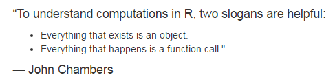
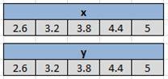

```{r setup, include=FALSE}
knitr::opts_chunk$set(echo = TRUE)
```

## Outline
* Recap
* Vectors Defined
* Atomic Vectors
* Lists
* Exercise

## Recap



## Recap
* Computations in the R Console
* Creation of variables
* R functions
* The Working Directory
* The Workspace
* R scripts
* Help


# Vectors Defined
## About Data Structures
* To be useful data has to be organised and properly structured.
* Rules and behaviour are set.
* This makes computing much easier.

**In R, we have**

* Atomic Vectors
* Lists
* Matrices
* Data frames
* Arrays

## Kinds of Vectors (basic)
* Atomic Vectors
* Lists

## Characteristics of Vectors
* Vectors are essentially uni-dimensional data structures.
* Length $\ge 1$. <!-- check MathJax -->
* The largest . well, depends on the .Machine


# Atomic Vectors
***
* This is the bedrock of R data structures.
* In computing, all data is in bits -> bytes
* This is made meaningful to humans in the form of types.
* Atomic because all elements are of a particular data type.
* Types can also be builtin or user-defined.
* In lay language, "type" would be *numbers*, *words*, etc.
* Atomic vectors are made of builtin data types.

## Kinds of Atomic Vectors
Six (6) kinds:

1. Character
2. Integer
3. Double (or numeric)
4. Logical

## Character Vectors
* Strings are always placed in quotation marks when coding i.e. `"boy"`, `"NARC`", `"R is easy to learn"`, `"A string can be a whole sentence!"`, `"9"`.
* Remember use quotation marks: `" "` or `' '`.
* We can create empty vectors with specific lengths e.g. `character(length = 10)`.
* Limit approx. $2^{31}$ (about 2 billion) characters!

***
* Some character vectors are inbuilt into R e.g. `letters`, `LETTERS`, `month.abb`, `month.name`.

```{r inbuilt char}
LETTERS
month.abb
```

## Integer Vectors
* Numbers but not numerical in an R sense
* 1L, 2L, 3L (Why the 'L'?)
* Wide range - max up to 2,147,483,647


## Numeric (or double) vectors
* These are real numbers
* Why the term double?
* Some numeric vectors are inbuilt especially mathematical constants e.g. `pi`.

```{r inbuilt double}
pi
```

## Logical vectors

* `TRUE`/`FALSE` (not true/false)
* Can be abbreviated to `T` or `F`
* Zero is `FALSE`; any non-zero is `TRUE`

```{r logi test}
as.logical(42)
as.logical(-99)
as.logical(0)
```

***

**Logical operators**

|     Description        | Keystroke |
|------------------------|-----------|
| Equals                 |  **==**   |
| Not equals             |  **!=**   |
| Less than              |  **<**    |
| Greater than           |  **>**    |
| Less than or equals    |  **<=**   |
| Greater than or equals |  **>=**   |
| 

## Making vectors
**By assignment**:

* One can provide input directly to create a vector
* This is usually best for vectors of length 1.

**By function calls**
_**The concatenate function - `c()`**_

## Making vectors
* Latin: *con-caten-atus* (chain). Some call it the "combine" function.
* *Indispensible* in creating vectors

* Mostly, vectors are created as a return value from a function call.
* Useful functions include `rep()`, `seq()`, etc. 

## Making vectors
**By 'growing'**:

* We can grow a vector from `NULL`.
* This is not a favoured approach as it's very expensive.
* Will show how, much, much, much, much later.


## Exercise


1. What type of vectors are `x` and `y`?
2. Create these vectors in R.
```{r exercise, include=FALSE}
x <- y <- c(2.6, 3.2, 3.8, 4.4, 5)
```

## Vector behaviour

* **Coercion**
    + Vectors will always attempt to force the data types to be the same.
    + Precedence for coercion

## Vector behaviour
* **Recycling**
    + 

## Vector behaviour
* **Vectorization** (duh!)
    + This is one of the major strengths of R!
    
## Vector Attributes
Each element of a vector can have a `name` attributes.

```{r named vector}
unnamed <- c('top', 'bottom', 'left', 'right')
unnamed

# A named vector
named <- c(north = 'top', south = 'bottom', west = 'left', east = 'right')
named
```

***

The vectors `named` and `unnamed` are equal but not identical.
```{r compare vectors}
named == unnamed

identical(named, unnamed)
```

To collect the names of a named vector (e.g. for programming) use the function `names()`
```{r return names}
cardinalPoints <- names(named)
cardinalPoints
```


## Vector Indexing
* We use the bracket operator, `[]`, to work with elements of a vector.
* We can **get** or **set** vector elements.


# Lists
***

* List are a unique data structure in that they can contain any kind of type or data structure as an element.
* Your use of lists is only limited by your creativity, imagination and degree of laziness.
* For instance we can combine vectors to form a list.

```{r}
vecList <- list(x = x, y = y)
vecList
```

***
* With lists we can overcome the type constraint of atomic vectors.
* This makes them useful in creating user-defined types.
    + This is key to object oriented programming.
* Further discussion on this later.

# Exercise

